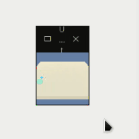

# DRL-ND-Project_2

## Description

In this project I trained a SAC agent to solve the unity environment "Reacher" which consist in a Double-jointed arm which must move to diferent target locations, the states and actions in the environment consists as follows:

* Vector Observation space: 26 variables corresponding to position, rotation, velocity, and angular velocities of the two arm rigid bodies.
* Vector Action space: (Continuous) Size of 4, corresponding to torque applicable to two joints.
* Visual Observations: None

## Getting Started

To train or test the sac_agent.

1. Clone this repo.
2. Create a virtual environment.
2. Over the environment run `pip install -r requirements.txt`

## Instructions

All the code to train or to test the sac agent is contained inside the **'Continuous_Control.ipynb'** file and following the cell instructions you can train an agent from scratch or test it loading the saved model.

## Results

The agent was able to achive a reward of +30 after 298 episodes. 